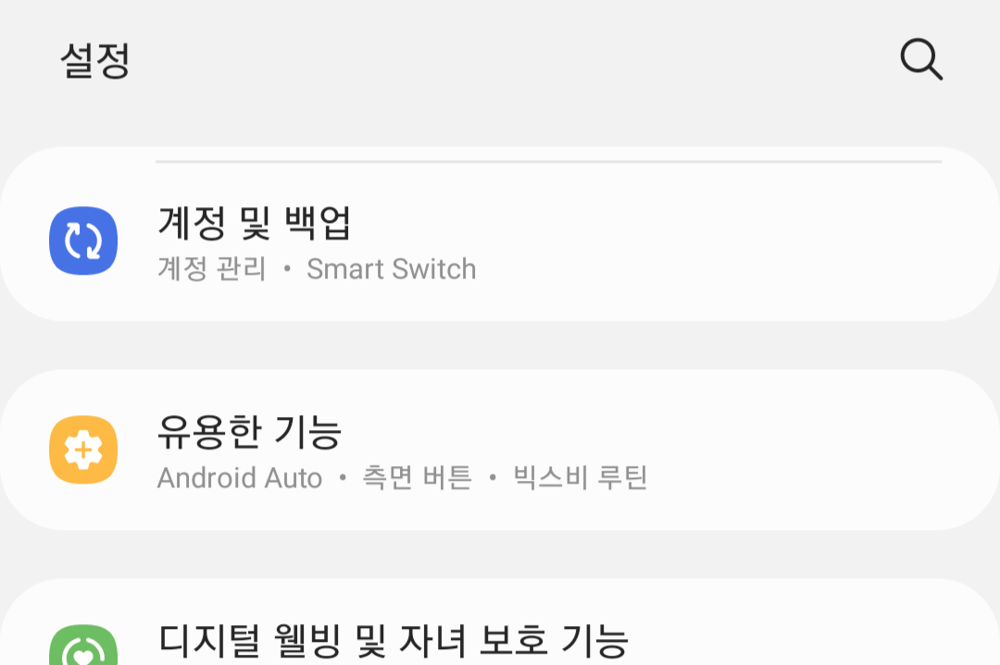
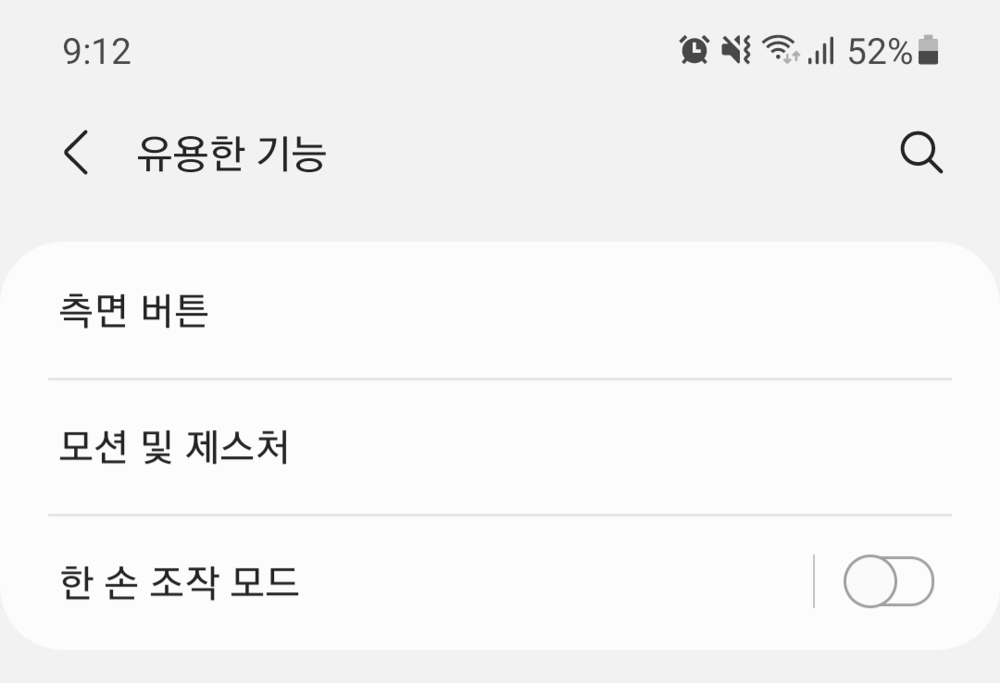
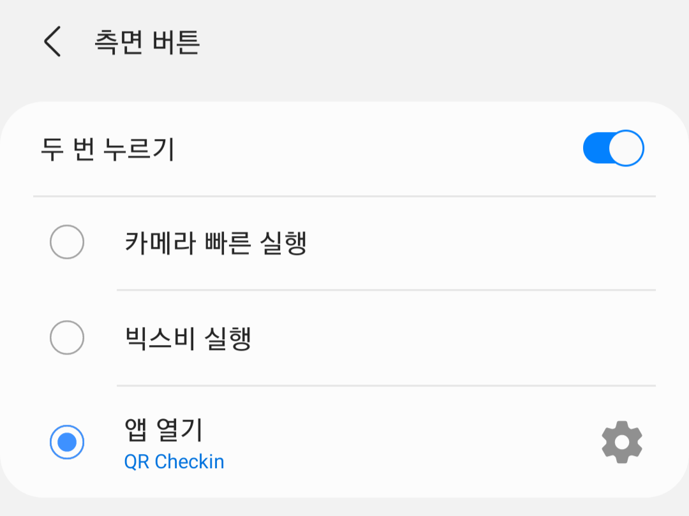

# QR Checkin

[Download](https://github.com/ShapeLayer/QR-Checkin/releases/download/1/qrcheckin-1bdc4cb2c0a240c880ea502778206085-signed.apk)

안드로이드의 측면 버튼 앱 실행 기능은 iOS와 달리 웹사이트 링크를 열기 어렵습니다. 그동안 PASS를 측면 버튼에 연결해놓고 사용했지만, 여전히 몇번 더 터치해야한다는 귀찮음이 있어 네이버 QR 체크인 화면을 바로 열어주는 앱을 만들었습니다.

## 사용법
1. [릴리즈](https://github.com/ShapeLayer/QR-Checkin)에서 본 레포 [빌드본을 다운받아 휴대폰에 설치](https://github.com/ShapeLayer/QR-Checkin/releases/download/1/qrcheckin-1bdc4cb2c0a240c880ea502778206085-signed.apk)하세요.
2. `설정` > `유용한 기능` > `측면 버튼`에서 설치한 앱을 연결하세요. (휴대폰 제조사마다 설치 방법이 다를 수 있음)

* 최초 실행 시 네이버 로그인이 필요합니다.
  * 본 앱은 어떤 정보도 저장하지 않습니다. [App.js](./App.js)를 참고하세요.

### One UI에서 설정 (삼성 스마트폰 기준)

  
`설정` > `유용한 기능`

  
`유용한 기능` > `측면 버튼`

  
`앱 열기` + 우측 `톱니바퀴` 버튼을 통해 QR Checkin 선택