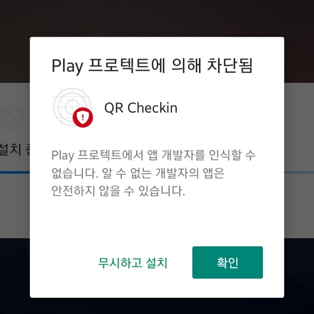
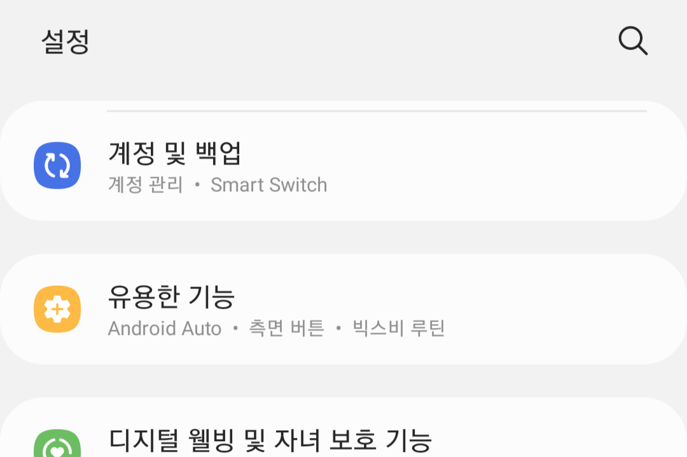
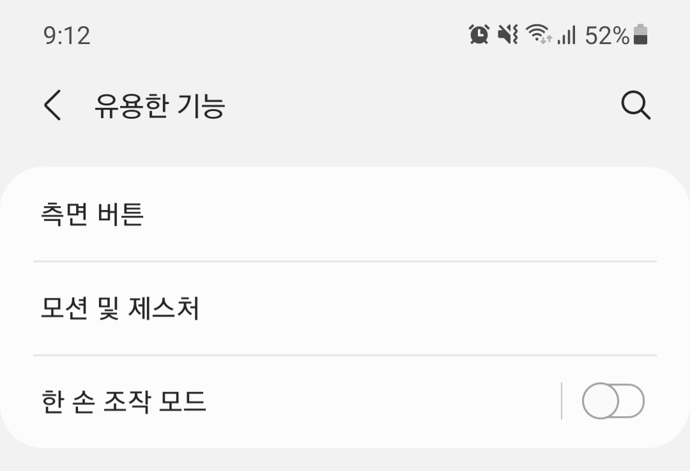
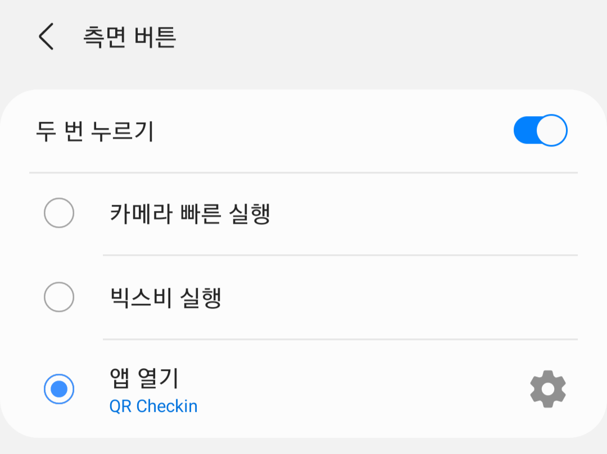

# 애플리케이션 설치 / 설정

[마지막 릴리즈 APK 파일 다운로드](https://github.com/ShapeLayer/QR-Checkin/releases/download/1/qrcheckin-1bdc4cb2c0a240c880ea502778206085-signed.apk)

본 애플리케이션은 `측면 버튼` 설정을 변경할 수 있는 기기를 대상으로 제작되었습니다. 하지만 홈 화면에 바로가기를 생성하여 한번의 터치로 바로 QR 인증을 진행할수는 있습니다.

## 애플리케이션 다운로드
[릴리즈](https://github.com/ShapeLayer/QR-Checkin/releases)에서 가장 최근 릴리즈의 APK 파일을 다운로드받습니다.

  
본 애플리케이션을 구글 Play 프로텍트에 등록하지 않아 (구글 Play 개발자 등록을 아직 하지 못했습니다 ㅠㅠ) 경고 문구가 발생합니다. `무시하고 설치`를 통해 설치를 완료합니다.

## One UI(삼성 스마트폰)에서 애플리케이션 바로가기 등록
| Step 1 | Step 2 | Step 3 |
| --- | --- | --- |
|  |  |  |
`설정` > `유용한 기능` > `측면 버튼` > `앱 열기` + 우측 `톱니바퀴` 버튼을 통해 QR Checkin 선택  

* 기기에 따라 해당 기능이 다른 위치에 있거나, 아예 존재하지 않을 수 있습니다.

## 명심해야 할 점
첫번째 릴리즈 애플리케이션 실사용 중 버그가 발견되었습니다. [이슈트래커 #1](https://github.com/ShapeLayer/QR-Checkin/issues/1)을 확인하세요.